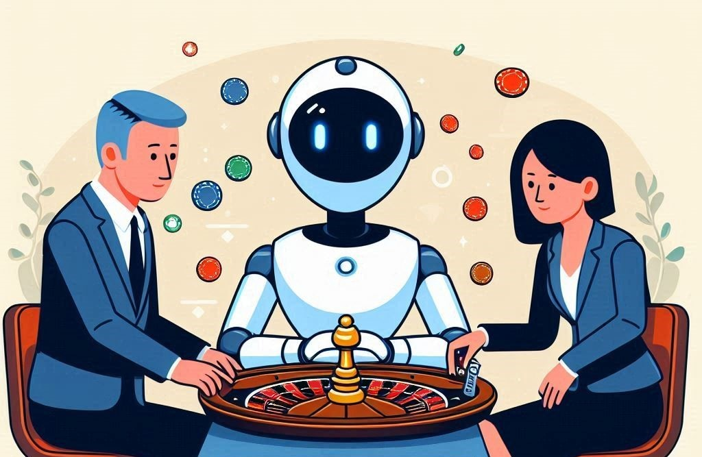
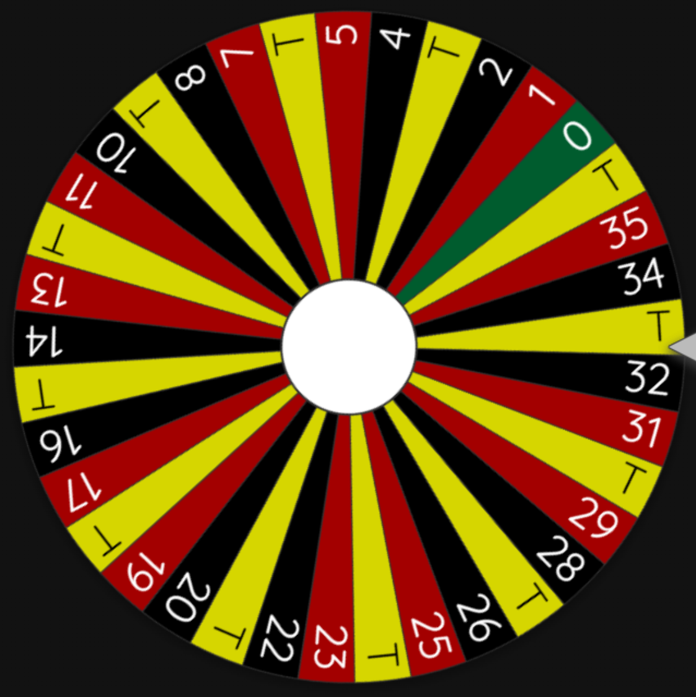
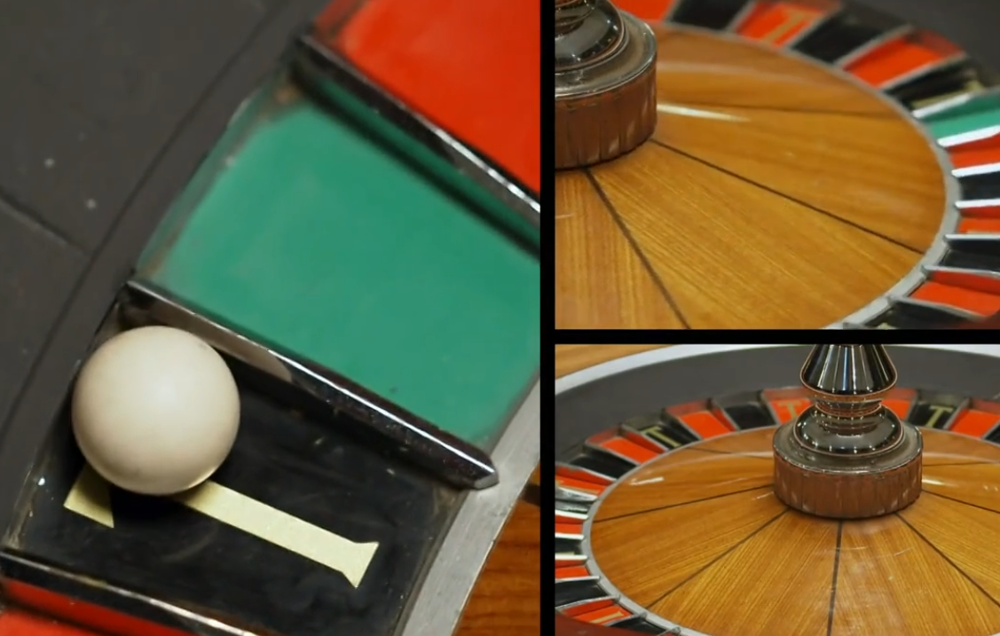
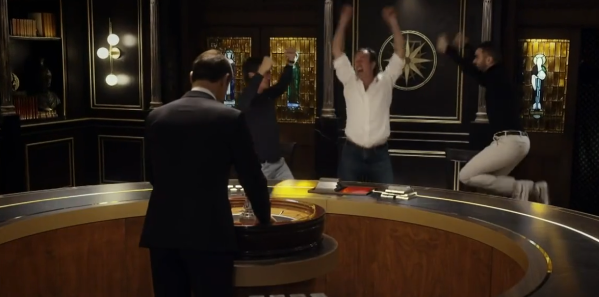
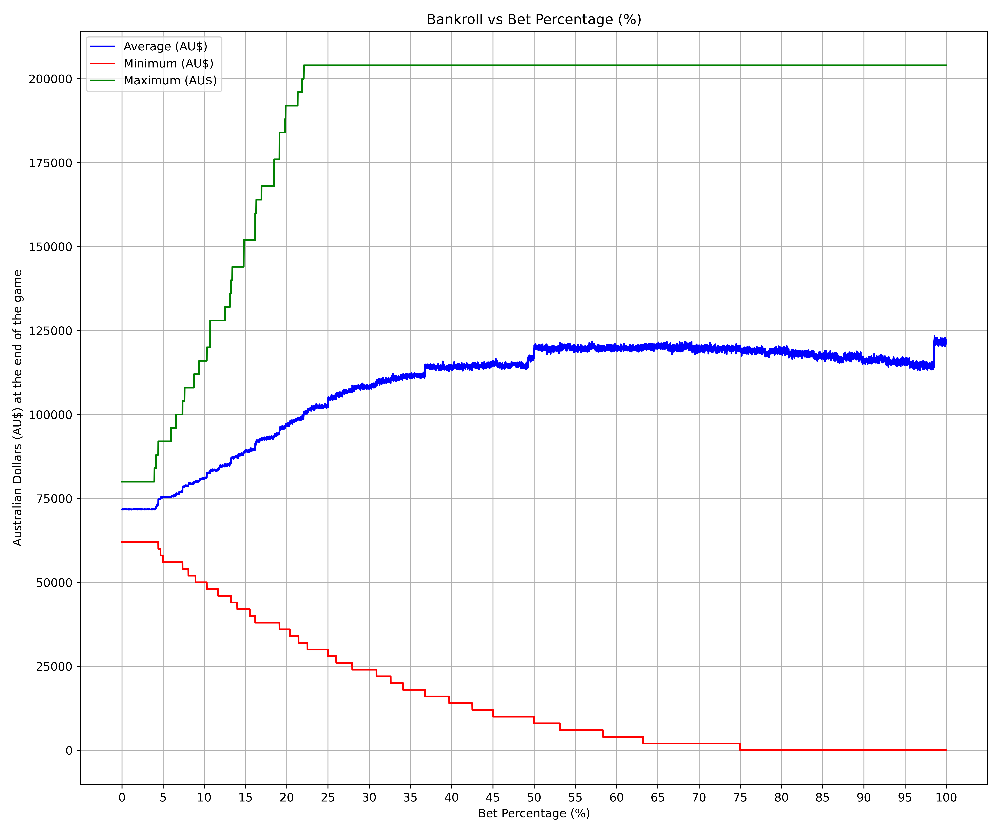
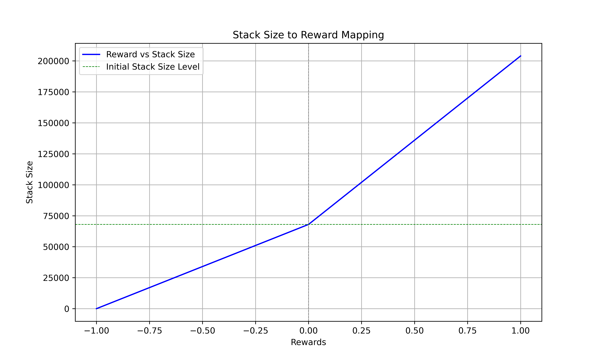
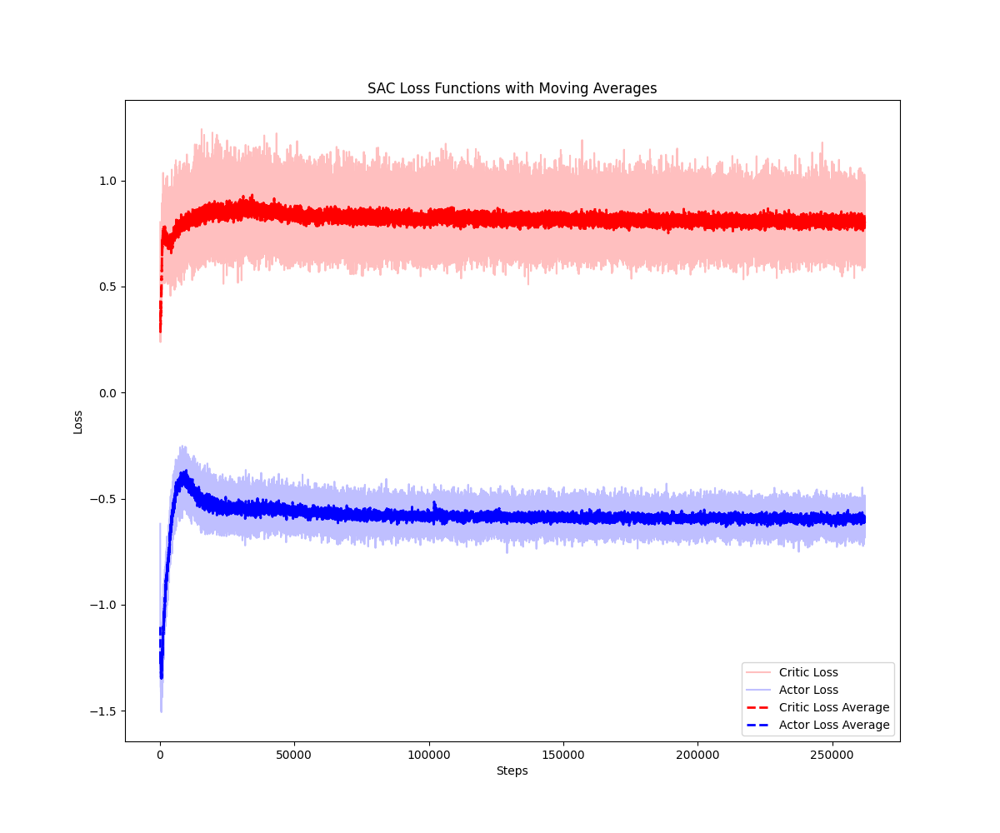
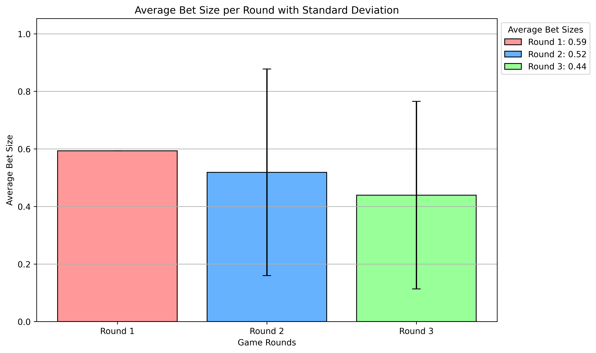
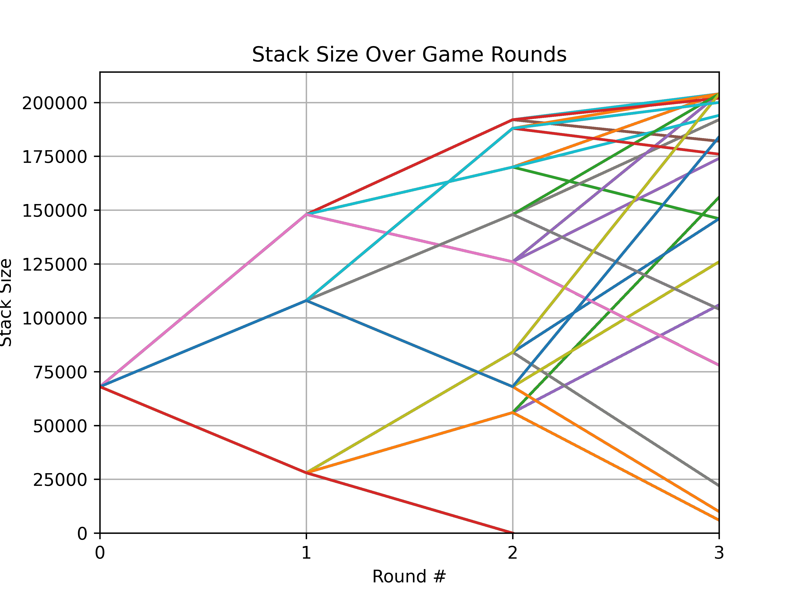

# Gameshow Roulette - Human vs. Machine



In the reality TV show (yeah, I know, don't comment on that please), the _[The Traitors Australia](https://w.wiki/9NDo)_ Season 1 Episode 6_, contestants were faced with a gambling game. In this article, we will see how they did and attacked the problem differently via maths, with programming solutions, and even delve into deep-learning and LLM solutions. Finally, we pin them against each other at the end. Who will have the better strategy?

## The Setup

An electrician, a legal professional, and a [former hostage](https://en.wikipedia.org/wiki/Nigel_Brennan) walk into a room. It sounds like the setup for a terrible joke, but in this case, it marks the start of a scene in a gameshow episode. These three people will gamble money from a shared account, which they or their peers can win at the end of the game. They are super excited about the whole thing, as you might gather from their faces.


### How does it work?

In front of them is a roulette wheel marked with the typical red and black pockets. There is also one green tile. In total, there are 37 tiles. So far, it is normal. However, there is one significant deviation from regular Roulette. Some tiles have the letter T written on them.



### The Rules



First, the constants have 68,000 Australian dollars at their disposal. We will call their total amount of money their __stake__.

1. the contestants decide how much money they want to bet
2. the contestants guess which color the roulette ball will land on and choose either red or black (green was not offered)

The moderator spins the wheel and lets the ball run. If they predict the color correctly, they double their bet. If the ball lands on a T, they triple their bet, and if they guess incorrectly, surprise - they will lose their bet. I have for you below an overview of the decisions and potential outcomes.

Nobody explicitly mentioned what happens when the ball lands on the green _0_ tile. Given the rules in regular Roulette, I’ll assume that contestants lose their bet if they land on _0_.

| Guess from constants | Ball landed on red 🔴 | Ball landed on black ⚫ | Ball landed on T | Ball landed on green 🟢 |
| -------------------- | --------------------- | ---------------------- | ---------------- | ----------------------- |
| black pocket 🔴      | lose bet              | win bet x2             | win bet x3       | lose bet                |
| red pocket ⚫         | win bet x2            | lose bet               | win bet x3       | lose bet                |

#### Constraints

There are four more limitations imposed by the production team:

1. the initial stake can only be tripled (i.e. $68.000 x 3 = $204,000)
2. the betting maximum for each given round is equal to the starting stake (max bet size = $68.000)
3. betting can only be done in increments of $2,000

The game ends if either of the following is true:

- the players have played three rounds
- the players have no money left
- the players acquired 3x of their initial stake

### The Question

In a regular Roulette game, where you bet on the dominant colors (red and black), you win only ~49% of the time on average. You do not have a 50/50 chance because there is at least one zero on the wheel.

> When placing a bet on red or black in standard Roulette, you have a likelihood of winning of about 48.65% in the European version and only 47.37% in the American version. American Casinos have a unique way of prioritizing their own interests over those of their customers and snuck not only one _0_ tile in there but also added an additional _00_ pocket.

In _Traitors Roulette_ you win ~64,86% of your games on average. Either by selecting the correct color tile or hitting a T-pocket, which triples your bet size, independent of which color you picked. Now I'm beginning to understand why our constants are so happy. Sitting there and watching the show, I started wondering

__'What is the best strategy to win some of that sweet price money?'__

## What do they do?

Let's first look at the actual decisions of the contestants and their outcomes.

### Round I

In the first round, they decided to bet $12,000 on black from their stake of $68,000 and hit a black pocket, bringing their new total to $80,000.


| Round | Stake Before Round | Bet     | Winnings | Stake After Round |
| ----- | ------------------ | ------- | -------- | ----------------- |
| I     | $68,000            | $12,000 | $24,000  | $80,000           |

The stake after the round is always calculated as follows:

> Stack Before Round - Bet + Winnings

or

> $68,000 - $12,000 + $24,000 = $80,000
>
### Round II

Filled with excitement the next time, they went black again and chose to place a bet of $12,000. They were not so lucky this time, as the ball landed in the red pocket, returning them to their initial stake of $68,000.


| Round | Stake Before Round | Bet     | Winnings | Stake After Round |
| ----- | ------------------ | ------- | -------- | ----------------- |
| II    | $80,000            | $12,000 | $0       | $68,000           |

### Round III

In the final round, they choose to bet $20,000 on good old black again. The ball landed in a T-Pocket, tripling their bet and leaving them with a grand total of $108,000.



| Round | Stake Before Round | Bet     | Winnings | Stake After Round |
| ----- | ------------------ | ------- | -------- | ----------------- |
| III   | $68,000            | $20,000 | $60,000  | $108,000          |

## Solutions

What would you have done in their shoes? What policy would you have adopted? Let's first put on our math hats and analyze the game.

### Expected Value

To get to the bottom of this, let's try some good old math (or skip this and continue with the next section if you don't feel mathsy today). We have 12 red, 12 black, 12 traitor tiles, and one _0_ tile. With this, we can calculate the expected value for a given spin on the wheel. The expected value is the average of all possible outcomes. In this case, we can calculate it by multiplying the probability of each outcome by the value of that outcome. Here is the calculation for each outcome:

- Win 2x: 𝑝(correct color, not T) = 12/37 ≈ 32,43%
- Win 3x: 𝑝(T) = 12/37 ≈ 32,43%
- Lose bet: 𝑝(wrong color or green) = 13/37 ≈ 35,13%

And all these accumulated gives us an expected value E(X):

> E(X) = (2 *12/37) + (3* 12/37) + (-1 * 13/37) = (24/37) + (36/37) - (13/37) = 29/37 ≈ 1.27

This means you are expected to win an average of $1.27 for each dollar you bet. That sounds like we should definitely spin that wheel.

Since there are 12 red and 12 black pockets, it's safe to assume their choice of black or red does not matter. All the candidates can influence is how much they bet. Therefore, the most important decision comes mainly down to their back-roll management.

#### The Amateur Mathematician's Solution

Bankroll Management helps maximize expected value while managing the risk of going bust and losing everything. In games where you lose your entire bet size, we can calculate an optimal betting strategy, for instance, by using the [Kelly criterion](https://en.wikipedia.org/wiki/Kelly_criterion). The formula is below:

> 𝑓 = 𝑝 - (𝑞/𝑏)

The variables are described as follows:

- 𝑓 is the fraction of the total stack the candidates should bet
- 𝑝 is the probability of a win
- 𝑞 is the probability of a loss
- 𝑏 is the proportion of the bet the candidates can win

You win when either picking a correct color or landing on the traitor tile. Since we have 12 tiles with individual colors and 12 traitor tiles, our 𝑝 is:

> 𝑝 = 24/37

𝑞 is just 1 minus p.

> 𝑞 = 1 - 𝑝 = 1-(24/37)

𝑏 varies depending on whether the candidates predict the color correctly, gaining them 2x of their bet. If they manage to hit a T, they triple their value.  Therefore, 𝑏 can be calculated as follows:

> 𝑏 = ((12 *2) + (12* 3)) / 24 = 2.5

Plugin in all the numbers leaves us with the following:

> 𝑓 = (24/37) - ( ( 1 - (24/37) ) / 2.5 ) = ~0.5081....

Using the Kelly criterion, the candidates should bet $34,550.80 from their initial stack of $68,000 to maximize their winnings while keeping an eye on their total bankroll. Considering [constraint](#constraints) _3._ let's round down to $34,000. In subsequent rounds, they should stick to the policy of betting ~50% or roughly 1/2 of their stack size.

Considering our [constraints](#constraints), this could lead to the best possible outcome of $204,000.
This requires us to hit the triple twice in a row to reach the theoretical maximum (see [constraint](#constraints) 1). We will always bet 50% of our stack and round to the nearest multiple of $2,000.

| Round | Stake Before Round | Bet     | Winnings | Stake After Round | Comment                                                             |
| ----- | ------------------ | ------- | -------- | ----------------- | ------------------------------------------------------------------- |
| I     | $68,000            | $34,000 | $102,000 | $170,000          |                                                                     |
| II    | $170,000           | $12,000 | $36,000  | $204,000          | we bet only $12,000 as we cannot win more than $204,000 in any case |

With a bet size of $12,000, we would theoretically win $206,000, but due to our [constraint](#constraints), we can only ever win a maximum of $204,000.

Let's also investigate the event we are very unlucky and every round is lost.

| Round | Stake Before Round | Bet     | Winnings | Stake After Round |
| ----- | ------------------ | ------- | -------- | ----------------- |
| I     | $68,000            | $34,000 | $0       | $34,000           |
| II    | $34,000            | $17,000 | $0       | $17,000           |
| III   | $17,000            | $8,000  | $0       | $9,000            |

In the worst case, we lose $59.000 - yikes. All of a sudden, this betting game seems dangerous again. But still, this policy at least ensures that you will not go bust. Let's not get blinded by our general tendency as [humans to be risk-averse](https://en.wikipedia.org/wiki/Prospect_theory).

The Kelly criterion does not consider the game's complete spectrum of [constraints](#constraints) and provides no insight into the expected values of a given bet size. Instead of worrying about that, let's write up some terrible Python code [in true Matt Parker fashion](https://www.youtube.com/watch?v=_-AfhLQfb6w). To analyze this issue from another point of view.

### Bruteforce The Way To Victory

In this section, we ignore all maths strategies and focus purely on playing the game to deduce some strategy. Based on the results, we will simulate the game and see the best strategy. This will also help us understand the expected value for a given bet percentage.

I recreated the code in Python, implemented the game, added the constraints, simulated 2^28 games (in total 268 million) with a fixed betting size strategy, and plotted the results on a chart. The code starts to bet 0.01%, plays 2,68 million games, and moves on to 0.02% to do it all over again until we reach a static bet size of 100% of the stack.



The graph shows the average stack size in blue at the end of games and the minimum and maximum reached values during the simulations. On the x-axis are percentages of the stack size that was a bet for the reach round. Combining the large amount to simulated games alongside the [law of large numbers](https://en.wikipedia.org/wiki/Law_of_large_numbers) allows us to assume the average stack size approximates the expected value.

The chart shows that the average resembles a step function, and the actual maximum occurs far down the line and peaks at ~98.6% of the bet size. These steps are explained mainly by the [constraints](#constraints) of the game. In particular, the fact that you can only bet multiples of $2,000 leads to this behavior of the function. For instance, see the step at the 50% tick. This is where you only need to play two games to max out the limit of 3x the initial stack size, given you hit the traitor tile and guessed the color correctly afterward. The table below details the bets and results at 50%.

| Round | Stake Before Round | Bet     | Winnings | Stake After Round | Comments                            |
| ----- | ------------------ | ------- | -------- | ----------------- | ----------------------------------- |
| I     | $68,000            | $34,000 | $102,000 | $136,000          | here we hit the traitor tile        |
| II    | $136,000           | $34,000 | $68,000  | $204,000          | here we guessed the color correctly |

We can bet less than 50% in the second round, as we can only win up to $204,000 anyway.

With 49%, you must still play three games in this scenario. More games mean more chances to lose money, which lowers expected value and, in turn, our expected value.

| Round | Stake Before Round | Bet      | Winnings                              | Stake After Round | Comment |
| ----- | ------------------ | -------- | ------------------------------------- | ----------------- | ------- |
| I     | $68,000           | $32,000 | $96,000 | $132,000         | here we hit a traitor tile |
| II    | $132,000          | $64,000 | $128,000  | $196,000         | here we guess the correct color |
| III   | $196,000           | $4,000   | $8,000                                | $204,000          | |

Something similar is going on with the spike at ~98.6%. We will first bet the whole stack around that value during the initial round. This allows us to win the maximum amount in the game possible by hitting a T-tile and stopping instantly after the first round.

This solution does not manage the risk of going bust. We also did not yet explore the benefits of setting the betting size to different values between rounds. To tackle this, we will look into another solution.

### The AI Solution

All previous solutions did not consider that contestants could change their bet size percentages between rounds. Although we could again use math to calculate the optimal bet size for each round, where is the fun in that? Instead, let's use AI to find the best strategy for variable bet sizes.

### Reinforcement Learning

Using the reinforcement learning algorithm [Soft Actor Critic (SAC)](https://medium.com/intro-to-artificial-intelligence/soft-actor-critic-reinforcement-learning-algorithm-1934a2c3087f), I trained an AI to play the game and find a betting strategy. I will gloss over a lot of detail here, but let's discuss one of the most important parts of the training process—the reward function. This is shown below.

```Python
def bankroll_to_reward(bankroll: int, initial_bankroll: int = 68000, max_bankroll: int = 204000) -> float:
 reward = 0
    # reward winnings
    if bankroll >= initial_bankroll:
 reward = (bankroll - initial_bankroll) / (max_bankroll - initial_bankroll)
    # punish losses
    else:
 reward = -1 + (bankroll / initial_bankroll)
    return reward
```

I decided to give the AI rewards purely based on the current bot size (aka `bankroll`) and punish it much more harshly for losses than gains. Here is an overview of different stack sizes and their associated rewards:


As you can see, the function is skewed and punishes losses more harshly. I decided to use this function to approximate [human loss aversion](https://en.wikipedia.org/wiki/Loss_aversion) and to model the fact that the peers of our contestants would most likely be less happy about losing money than winning any. The AI was trained by playing 2^18 (262,144) games, but based on the algorithm's loss functions, the AI stabilized after ~50,000 steps.



#### Evaluation

After training my model, I let the AI play 2^18 games (262,144) and checked the results. Here are some key performance indicators (KPIs).

| KPI                                       | Value       |
| ----------------------------------------- | ----------- |
| % of games going bust                     | 12.13%      |
| % of games winning the maximum            | 21.08%      |
| average bet size overall                  | 0.59%       |
| average stack size at the end of the game | $130,175.90 |

KPIs are fine and all, but how does the AI actually behave in these games? I decided to get a better understanding by plotting the average bet size and its standard deviation on a graph.



The graph shows the average betting size as a bar chart. The black line shows the maximum and minimum bet sizes over all the rounds played. The AI always opens with a bet size of 59% of the stack size. In other words, $40,120. However, this is not a valid bet size and was always rounded to $40,000 since we can only bet increments of $2,000 (see [constraints](#constraints)). This, in part, is likely an artifact of my implementation. Instead of letting the AI bet a specific amount of money, I let the AI bet a percentage of its current stack while ensuring it bets at least the minimum amount of $2,000 as defined by the constraints of the game. In addition, converting the betting percentage back into actual bets introduced some rounding artifacts. This may also affect the learning process. But I'll give this implementation my stamp of "good-enough-for-the-time-being".

The bet sizes in other rounds have large standard deviations. We cannot tell much for rounds two and three by looking at this graph. So, let's plot the complete decision tree of all games.



This admittedly cluttered graph shows how the AI was betting for each round and each given stack size. The AI always starts with $68,000 and places a bet of $40,000, wins by guessing the correct tile color, hitting a traitor pocket, or loses. When studying the chart more closely, the AI often decides to bet ~$40,000. In this article's [competition](#the-competition) section, we will look into a concrete instance of the AI choosing policies in a game.

### The Lazy Person-AI-Solution

Finally, we throw the problem statement into an LLM and see what it spits out. I picked Claude (3.5 Sonnet, Oct 2024) because it is currently the best (in my personal opinion). I described the game and restrictions to the LLM and stated the initial question:

> What is the best strategy to win some of that sweet price money?

```markdown
The mathematically optimal strategy is to bet the maximum amount ($68,000) in the first round, 
and if necessary, continue with maximum possible bets in subsequent rounds to reach the target. 
While this strategy has a high risk of total loss, it maximizes the probability of reaching the 
3x goal within the three-round constraint.
```

Basically, the LLM is going with the expected value, which we also discovered in our brute-forced solution approach.

## The Competition

Let's now pin all of these solutions against each other. And if you want, you can also come up with your policy and check how it would fare against other strategies. I will acknowledge that this way of "n=1-evaluation" is not very scientific. In addition, the different approaches had different goals. For instance, the Kelly Criterion and the search for the best-expected value had different objectives in mind. Not to mention the screwed reward function we used or the implicit bias I brought into the mix by my choice of words in the prompt for the LLM. All in all, we could reasonably argue that these policies are not directly comparable. But after all that theory we discussed, let's have fun with an example. We take the strategies from above, assume we encountered the same wins and losses as the contestants, and see who would win in that scenario.

### The Humans

To recap, this is what the contestants were going for:

| Round | Stake Before Round | Bet     | Winnings | Stake After Round |
| ----- | ------------------ | ------- | -------- | ----------------- |
| I     | $68,000            | $12,000 | $24,000  | $80,000           |
| II    | $80,000            | $12,000 | $0       | $68,000           |
| III   | $68,000            | $20,000 | $60,000  | $108,000          |

### The Kelly Criterion

We will always use the Kelly criterion and bet 50,81% of our stack size.
We round our bets to fit to the closest multiple of $2,000.

| Round | Stake Before Round | Bet | Winnings | Stake After Round |
| ----- | ------------------ | --- | -------- | ----------------- |
| I     | $68,000            | $34,000   | $68,000  | $102,000 |
| II    | $102,000           | $52,000   | $0       | $50,000 |
| III   | $50,000            | $26,000   | $78,000        | $128,000  |

### The Best Expected Value

The brute-force solution suggested that the highest expected value is to bet ~98.6% of the stack size, which equates to the whole stack after rounding. As the LLM agreed to this solution, I will compound their betting policy in the table below.

| Round | Stake Before Round | Bet | Winnings | Stake After Round |
| ----- | ------------------ | --- | -------- | ----------------- |
| I     | $68,000            | $68,000   | $136,000 | $136,000 |
| II    | $136,000           | $68,000   | $0       | $68,000 |
| III   | $68,000            | $68,000   | $204,000 | $204,000  |

This solution wins it all in the end.

### The Deep Learning AI

| Round | Stake Before Round | Bet     | Winnings | Stake After Round |
| ----- | ------------------ | ------- | -------- | ----------------- |
| I     | $68,000            | $40,000 | $80,000  | $108,000          |
| II    | $108,000           | $40,000 | $0       | $68,000           |
| III   | $68,000            | $58,000 | $184,000 | $194,000          |

The AI starts out with its standard bet of $40,000, wins the first round, and loses the second. By then, it went with a sizeable bet and closed the 3rd round with a profit.

### Overview

Below are our final scores.

| Place | Player              | Final Score |
| ----- | ------------------- | ----------- |
| 1.    | Best Expected Value | $204,000    |
| 2.    | Deep Learning AI    | $194,000    |
| 3.    | Kelly Criterion     | $128,000    |
| 4.    | Humans              | $108,000    |

There we have it. The solution that takes the best expected value into account is the winner of our example.

I do not doubt that there are better or more nuanced solutions, but for now, I have already spent quite some time and effort on this short little project, so I will leave it here. I have all my code on [GitHub](https://github.com/jo-hoe/traitor-roulette) for you to check out and play with if you want to give it a go.
